# cypress_testing_nextjsapp Testing Documentation With Cypress

## Table of Contents
- [cypress\_testing\_nextjsapp Testing Documentation With Cypress](#cypress_testing_nextjsapp-testing-documentation-with-cypress)
	- [Table of Contents](#table-of-contents)
	- [Introduction](#introduction)
		- [Purpose](#purpose)
		- [Scope](#scope)
		- [Audience](#audience)
		- [Testing Environment](#testing-environment)
			- [Requirements:](#requirements)
			- [Environments:](#environments)
		- [Testing Strategy](#testing-strategy)
	- [Test Cases and Scenarios](#test-cases-and-scenarios)
	- [Conclusion](#conclusion)
	- [Getting Started](#getting-started)
	- [Learn More](#learn-more)
	- [Deploy on Vercel](#deploy-on-vercel)
 


## Introduction
### Purpose
This technical documentation is just to demonstrate how to use Cypress for testing web application.
### Scope
In this documentation we focus on two main testing techniques used to test web application using cypress. These are; ***Component Testing*** and ***End-to-End testing***

### Audience
The documentation serves as a knowledge repository for future developers, testers, and team members who can reference it to understand the testing history, methodologies, and outcomes of using **Cypress** for software testing.

### Testing Environment
#### Requirements:
- Cypress:
  - Node.js: Cypress is a Node.js tool, so you need to have Node.js installed on your system.
  - Operating System: Cypress supports Windows, macOS, and Linux.
  - Browser Support: Cypress primarily supports Google Chrome, but it also supports other browsers like Microsoft Edge and Mozilla Firefox.
- Next.js:
  - Node.js: Next.js is built on top of Node.js, so you need to have Node.js installed.
  - npm or Yarn: npm (Node Package Manager) is included with Node.js, or you can use Yarn as an alternative package manager.
  - Operating System: Next.js is compatible with Windows, macOS, and Linux.

#### Environments:
- ***Staging***:
  - Open this folder in vscode.
  - In the current directory type the following command;
	```bash
	npm install
	```
	Or
	```bash
	yarn install
	```
	To install all dependencies.
  - Type the following command install Cypress as a ***dev*** dependency: 
   ```bash
   npm install cypress --save-dev
   ```
   Or
   ```bash
   yarn install cypress --save-dev
   ```
- ***Development Environment***:
    - To use cypress for E2E testing you need to start the development environment.
    - To start the development environment you type the command 
     ```bash
	 npm run dev
     ```
	 OR
     ```bash
	 yarn run dev
     ```
- ***Production***:
  - Make sure the production server is running open the following URL in the webpage [http://localhost:3000](#http://localhost:3000)
  
### Testing Strategy
- #### Testing Types:
  - The two main testing types we are going to be implementing are: (Black Box testing), (White Box testing).
- #### Test Levels:
  - E2E Testing and Component Testing.
- #### Testing Methodology:
  - In testing the web application, we first start the Cypress Server by opening a new command line and typing the following command in the command line `npx cypress open`
  - After a while you should see the following window opened: 
  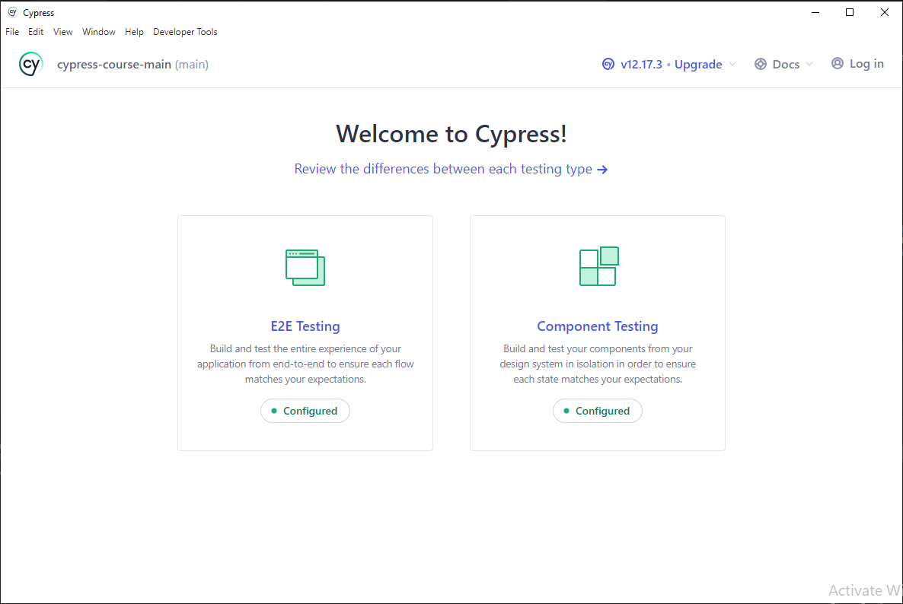

## Test Cases and Scenarios
  - ### E2E Testing
    - For E2E testing we click part circled with red:
     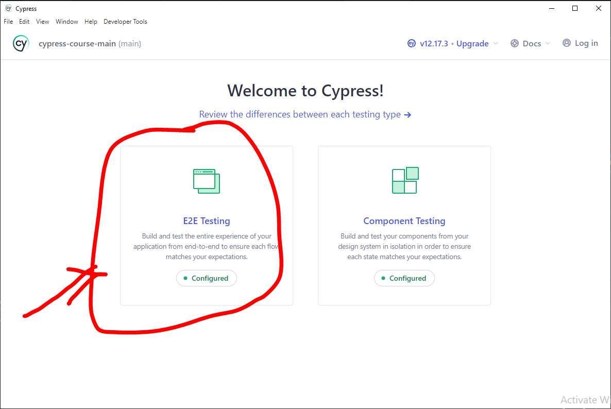
	 - You will get another window where you'll be asked to choose a browser and click on "Start E2E Testing in Chrome" as your testing environment we will choose chrome for now:
  
        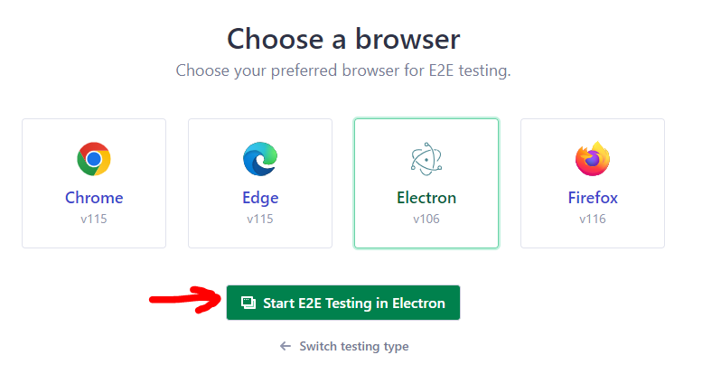
	- Result:
	 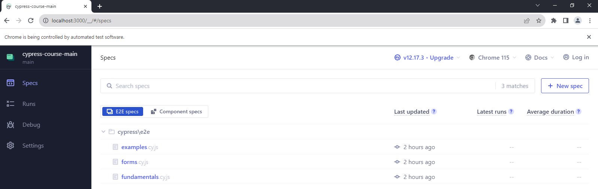
    - Now as you can see we already have some tests. But to write tests locate and click the button called "new spec". This is what pops up next: 
    
    	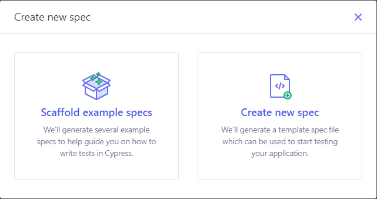 
	- Click on the create new spec button to create an new spec/test we are going create the spec fundamentals: 
       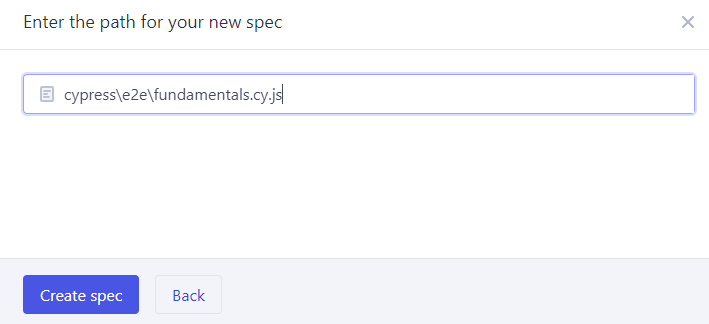
	- Now in our fundamentals.cy.js folder, we can see several code snippets. I will explain each of them:
      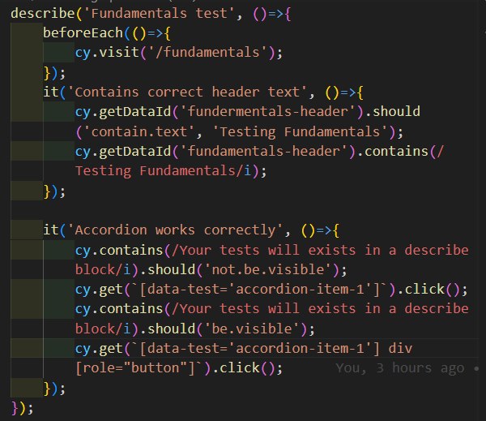

	  - describe(): Is a Mocha suite function
        which describes a "suite" with two arguments a title and callback function containing may contain nested suites(describe) and or it() functions.
      - it(): Is an equivalence to the Mocha test function. It takes two arguments with the first being a string which describes the test cases and the second which is a callback function which contain the 'cy' api for assertions.
      - cy api: The cy api is used for assertions by chaining it with other methods which comes along with cypress such as the get method which gets a css selector for it to be asserted.
  	> For more information check the [cypress documentation](https://docs.cypress.io/api/table-of-contents)

Only available when invoked via the mocha CLI. 
  - ### Component Testing
    - For component testing follow the following steps by clicking on the parts marked with red ink:
       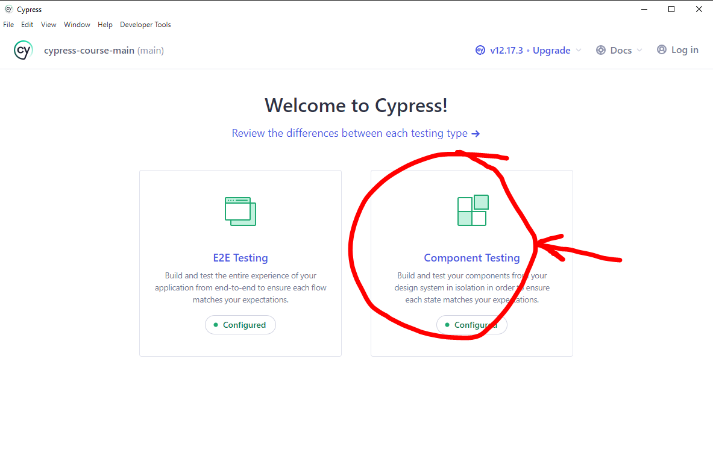

  	   Next

	   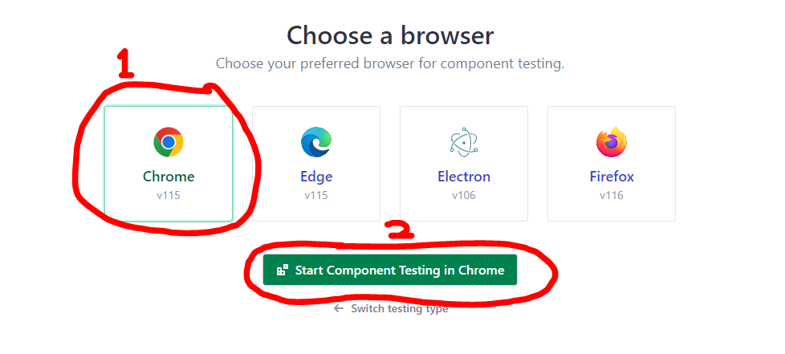

	   Next 

	   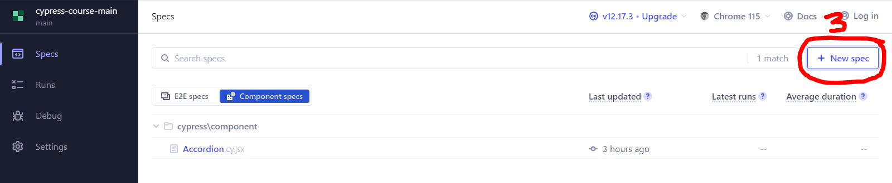

	   Next

	   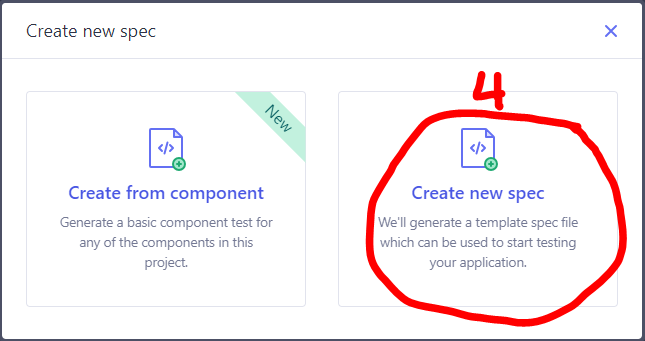

	   Next

	   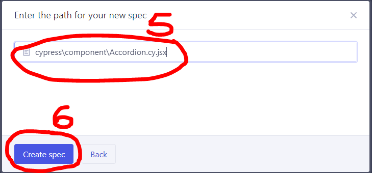
	- Writing our component tests:
 
    	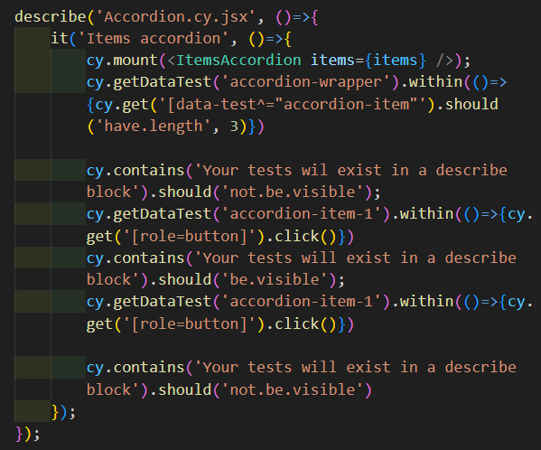
	- Remarks: Every concept in E2E testing can be extended here. I will explain a few things in the component testing.
    	- mount(): It takes a component as an argument.
    	- within(): It takes a callback as an argument to access the nested element within an html element.
    	> For more information on this check out the [cypress documentation](https://docs.cypress.io/api/table-of-contents) 
## Conclusion

This technical documentation provides a comprehensive overview of the testing process for cypress_testing_nextjsapp. It covers various testing phases, strategies, and methodologies to ensure the application's quality and reliability. By following the guidelines outlined in this documentation, the testing team can effectively identify and rectify defects, ensuring a seamless user experience.
***
***
***


This is a [Next.js](https://nextjs.org/) project bootstrapped with [`create-next-app`](https://github.com/vercel/next.js/tree/canary/packages/create-next-app).

## Getting Started

First, run the development server:

```bash
npm run dev
# or
yarn dev
# or
pnpm dev
```

Open [http://localhost:3000](http://localhost:3000) with your browser to see the result.

You can start editing the page by modifying `app/page.js`. The page auto-updates as you edit the file.

This project uses [`next/font`](https://nextjs.org/docs/basic-features/font-optimization) to automatically optimize and load Inter, a custom Google Font.

## Learn More

To learn more about Next.js, take a look at the following resources:

- [Next.js Documentation](https://nextjs.org/docs) - learn about Next.js features and API.
- [Learn Next.js](https://nextjs.org/learn) - an interactive Next.js tutorial.

You can check out [the Next.js GitHub repository](https://github.com/vercel/next.js/) - your feedback and contributions are welcome!

## Deploy on Vercel

The easiest way to deploy your Next.js app is to use the [Vercel Platform](https://vercel.com/new?utm_medium=default-template&filter=next.js&utm_source=create-next-app&utm_campaign=create-next-app-readme) from the creators of Next.js.

Check out our [Next.js deployment documentation](https://nextjs.org/docs/deployment) for more details.
